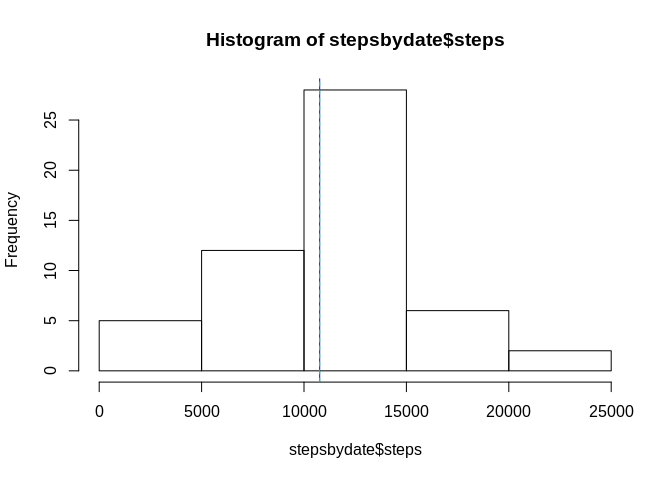
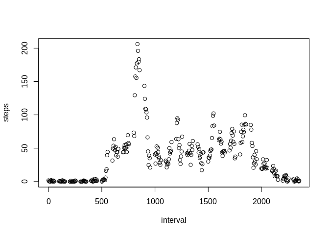

## Loading and preprocessing the data

First, unzip the data (activity.zip) included in the repo at the root of your project directory.  
Then, you can load the data and assign it to activitydata


```r
activitydata <- read.csv("activity.csv")
```

We should check our data


```r
str(activitydata)
```

```
## 'data.frame':	17568 obs. of  3 variables:
##  $ steps   : int  NA NA NA NA NA NA NA NA NA NA ...
##  $ date    : Factor w/ 61 levels "2012-10-01","2012-10-02",..: 1 1 1 1 1 1 1 1 1 1 ...
##  $ interval: int  0 5 10 15 20 25 30 35 40 45 ...
```

It seems there is a lot of NAs in steps at first sight, but in fact there is 2304, which is acceptable  
We should transform our date column to a date format, using lubridate package

```r
library(lubridate)
activitydata$date <- ymd(activitydata$date)
```

Let's check our date column now :

```r
str(activitydata$date)
```

```
##  Date[1:17568], format: "2012-10-01" "2012-10-01" "2012-10-01" "2012-10-01" "2012-10-01" ...
```

## What is mean total number of steps taken per day?

First, we need to sum the steps taken per day

```r
stepsbydate<-aggregate(steps~date,activitydata,sum)
```

We are now able to calculate the mean and median

```r
meansteps <- mean(stepsbydate$steps)
mediansteps <- median(stepsbydate$steps)
```

The mean is 1.0766189\times 10^{4} and the median is 10765

We should watch this on a histogram, mean in blue and median in green

```r
hist(stepsbydate$steps)
abline(v=meansteps,col="blue")
abline(v=mediansteps,col="green",lty=2)
```

<!-- -->

## What is the average daily activity pattern?

First, we need to aggregate the number of steps taken by interval


```r
stepsByInterval <- aggregate(steps~interval,activitydata,mean,na.rm=TRUE)
```

Plot the results


```r
plot(stepsByInterval)
```

<!-- -->

We see there is a high peak, we should find from which interval it comes from

```r
stepsByInterval$interval[which.max(stepsByInterval$steps)]
```

```
## [1] 835
```

## Imputing missing values

Letś find out how many rows containing NAs. We will add a column indicating the presence of NAs in the row, and then we will sum this column


```r
activitydata$napresence <- is.na(activitydata$steps) | is.na(activitydata$date)
sum(activitydata$napresence)
```

```
## [1] 2304
```

Now, let's fill the missing values with the mean steps of the corresponding interval


```r
activitydatafilled <- activitydata

for (i in 1:length(activitydatafilled$steps)) {
        if (is.na(activitydatafilled$steps[i])==TRUE) {
                fillvalue <- subset(stepsByInterval,interval==activitydatafilled$interval[i])[[2]]
                activitydatafilled$steps[i] <- fillvalue
        }
}
```

We can now calculate the mean and median number of steps taken per day with this filled data.


```r
stepsbydatefilled<-aggregate(steps~date,activitydatafilled,sum)
meanstepsfilled <- mean(stepsbydatefilled$steps)
medianstepsfilled <- median(stepsbydatefilled$steps)
```

||mean|median|
|---|---|---|
|with NAs data|1.0766189\times 10^{4}|10765|
|with removed NAs data|1.0766189\times 10^{4}|1.0766189\times 10^{4}|

We notice that the mean and median are mostly the same as before, because we populated the NAs based on the mean.

## Are there differences in activity patterns between weekdays and weekends?

